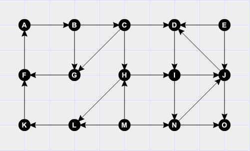

## A Strongly Connected Component with Multiple Cycles ##

A strongly connected component is a subgraph of a directed graph that contains a path between each pair of vertices of the subgraph, and does not contain additional vertices and edges that would break this property. It is **not** simply a cycle that is the largest it can be; however, a strongly connected component with more than one vertex in it must contain at least one cycle.

I will try to demonstrate that two cycles that contain a common subset of vertices are in the same strongly connected component, but not all vertices in the smaller cycle need be in the larger cycle. I will use Kosaraju's algorithm, the algorithm that is taught in ECS 60 to find strongly connected components in a directed graph.

Here is a graph:

Notice two cycles: `CBAFG` and `CBAFKLH`. However, the strongly connected component should contain `A`, `B`, `C`, `F`, `G`, `H`, `K`, and `L`. There is a path between each pair of vertices in that set. For example, to get from `G` to `L`, you can travel around the smaller cycle to `F`, then follow the direct edges from `F` to `K` and from `K` to `L`.

I started the DFS at vertex `O`. This is the order that I came up with for the finish times (post order numbering).

- `A`: 8
- `B`: 9
- `C`: 10
- `D`: 11
- `E`: 1
- `F`: 7
- `G`: 6
- `H`: 3
- `I`: 12
- `J`: 14
- `K`: 5
- `L`: 4
- `M`: 2
- `N`: 13
- `O`: 15

Now here is the transpose of the graph:

The first strongly connected components found are `O` and `JDIN`. Nothing fancy. Now we start the DFS at vertex `C`, since it has the highest numbering of the vertices remaining. This DFS visits vertices, in this order (using Sean's rule of visiting alphabetically labled vertices first if there is a choice), `C`, `G`, `F`, `A`, `B`, `H`, `L`, and `K`. You can see that there is no single cycle that contains all these vertices, yet they are still in the same strongly connected component.

Also, for your entertainment and to give credit, here is a link to the website I used to generate the graphs: [Make pretty graphs!](http://illuminations.nctm.org/Activity.aspx?id=3550)
